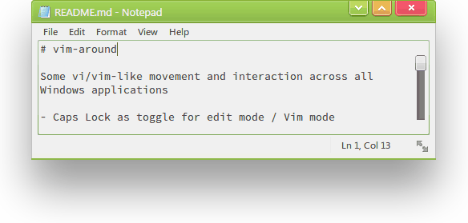

# vim-around

Some vi/vim-like movement and interaction across all Windows applications

- Caps Lock as toggle for edit mode / Vim mode
- hjkl, 0, $, b, w -movements for moving the cursor

- i for edit mode
- u for undo
- d for deleting a selection
- dw for deleting the next word (the next continuous block of text)
- db for deleting previous word (the previous continuous block of text)
- dd for deleting entire line from current cursor position
- cw for changing the word forward from current cursor position
- cb for changing the word backward from current cursor position
- Shift-a for appending to end of line and swapping to edit mode
- a for appending to the end of word
- o for starting a new line and swapping to edit mode